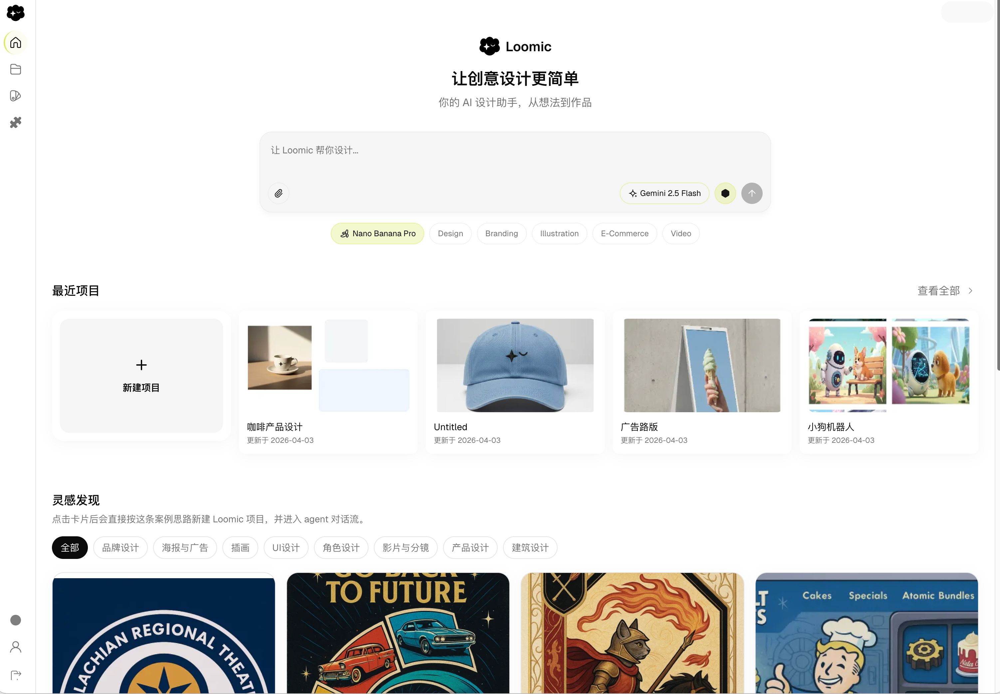
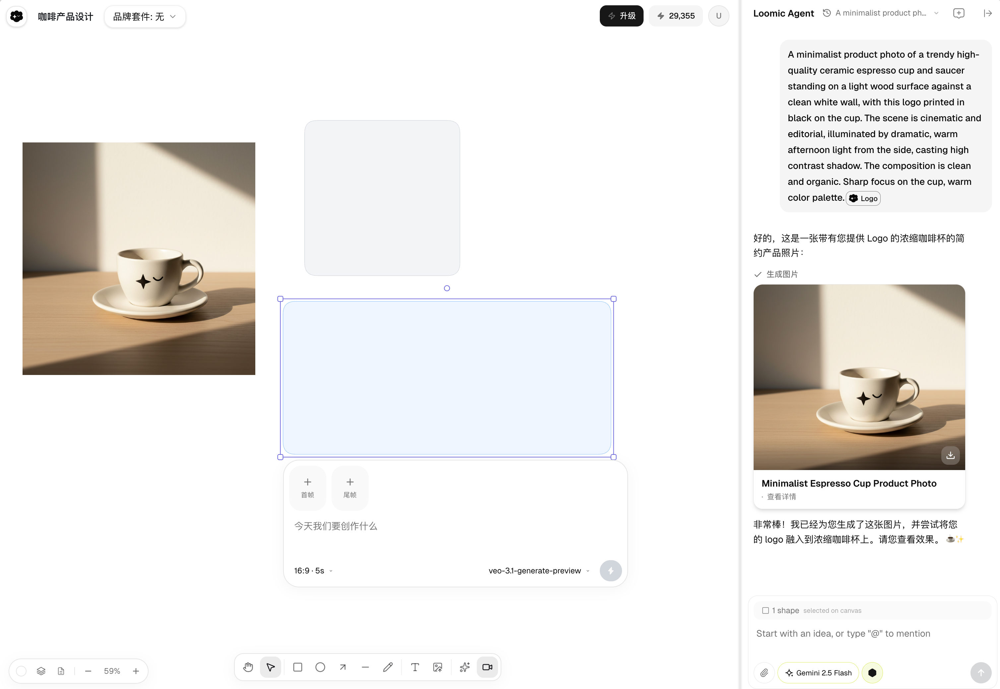

<h1 align="center">
  <a href="https://loomic-one.vercel.app" target="_blank">Loomic</a>
</h1>

<p align="center">
  Automated AI canvas design agent — for ads, e-commerce, social media, and beyond.
</p>

<p align="center">
  <a href="https://loomic-one.vercel.app">
    
  </a>
</p>

<p align="center">
  <a href="https://github.com/fancyboi999/Loomic/stargazers">
    
  </a>
  <a href="https://github.com/fancyboi999/Loomic/blob/main/LICENSE">
    
  </a>
  <a href="https://discord.gg/TODO">
    
  </a>
</p>

<p align="center">
  
  
  
  
  
  
  
  
  
  
</p>

<p align="center">
  
</p>

---

## 💡 Loomic 是什么

做广告图、电商主图、社交媒体素材、品牌视觉、短视频封面——这些活儿过去要在 Canva 里拖半天，或者等设计师排期。

Loomic 换了个思路：你在画布上说一句话，AI 直接把东西生成出来，摆好位置，调好样式。不满意就继续聊，改到满意为止。整个过程不用写 prompt 模板，不用手动导入导出，画布就是你的工作台。

底层跑的是 LangGraph 驱动的 Agent，接了 Google Gemini / Vertex AI / OpenAI / Replicate 十几个模型，图片视频都能生。开源，可以自己部署，数据全在你手里。

<p align="center">
  
</p>

---

## ✨ Features

🗣️ **对话式画布设计**
- 在无限画布上和 AI 对话，直接生成、编辑、排版
- 多轮对话迭代，说"把左边那张图换成暖色调"就行
- Agent 看得懂画布上下文，知道你在说哪个元素

🖼️ **图片生成（15+ 模型）**
- Google Imagen 4 / Gemini Image / Vertex AI
- OpenAI DALL-E 3 / GPT Image
- Replicate: Flux Kontext, SDXL, Recraft, Seedream...
- 填自己的 API Key，按需组合

🎬 **视频生成**
- Google Veo 3.1 / 3.0 / 2.0（文生视频、图生视频）
- Replicate: Kling, Seedance, Wan, Sora, Hailuo...
- 支持原生音频生成

🎨 **无限画布**
- 基于 Excalidraw，自由拖拽、缩放、分层
- AI 生成的素材直接落在画布上，不用手动导入
- 导出、截图、分享

🏷️ **Brand Kit**
- 设定品牌色、字体、Logo
- AI 生成时自动遵循品牌规范
- 集成 Google Fonts

💰 **积分 & 付费**
- 内置积分系统，按量计费
- LemonSqueezy 订阅集成
- 免费用户每天有基础额度

🧩 **可扩展技能系统**
- Markdown 定义 workspace 技能
- 按项目扩展 Agent 能力

---

## 🏗️ Architecture

```
┌─────────────┐     WebSocket / REST      ┌─────────────────┐
│   Next.js   │ ◄──────────────────────►  │  Fastify API    │
│   Frontend  │                           │  + LangGraph    │
│  (Vercel)   │                           │  Agent (Railway) │
└─────────────┘                           └────────┬────────┘
                                                   │ PGMQ
                                          ┌────────▼────────┐
                                          │    Worker(s)     │
                                          │  Image / Video   │
                                          │  Generation      │
                                          │  (Railway)       │
                                          └────────┬────────┘
                                                   │
                                          ┌────────▼────────┐
                                          │    Supabase      │
                                          │  PostgreSQL      │
                                          │  Auth / Storage  │
                                          └─────────────────┘
```

| Component | Tech | Role |
|-----------|------|------|
| **Frontend** | Next.js 15 + React 19 + Tailwind CSS 4 | Canvas UI, chat panel, workspace |
| **API Server** | Fastify 5 + LangGraph | Agent runtime, WebSocket, REST API |
| **Worker** | Node.js poll-based consumer | Async image/video generation jobs |
| **Database** | Supabase (PostgreSQL) | Data, auth, storage, job queue (PGMQ) |
| **Canvas** | Excalidraw 0.18 | Infinite canvas rendering |
| **AI** | LangChain + LangGraph | Agent orchestration, tool calling |
| **Queue** | PGMQ | Reliable async job processing |

---

## 🛠️ Tech Stack

| Layer | Technology |
|-------|-----------|
| Monorepo | Turborepo + pnpm |
| Frontend | Next.js 15 (App Router), React 19, Tailwind CSS 4 |
| Canvas | Excalidraw |
| Backend | Node.js, Fastify 5, TypeScript |
| AI Framework | LangChain 1.2, LangGraph 1.2 |
| LLM Providers | OpenAI, Google Gemini, Google Vertex AI |
| Image Generation | Imagen, DALL-E, Replicate (13+ models) |
| Video Generation | Google Veo 3.x, Replicate (Kling, Sora, Seedance, etc.) |
| Database | PostgreSQL (Supabase) |
| Auth | Supabase Auth (Magic Link + OAuth) |
| Storage | Supabase Storage (S3-compatible) |
| Queue | PGMQ (PostgreSQL native) |
| Payments | LemonSqueezy |
| Linting | Biome |
| Testing | Vitest |

---

## 🚀 Getting Started

### Prerequisites

- **Node.js** >= 20
- **pnpm** >= 10 (`npm install -g pnpm`)
- **Supabase CLI** (`brew install supabase/tap/supabase`)
- A [Supabase](https://supabase.com) project (free tier works)
- At least one AI API key (Google or OpenAI)

### 1. Clone & Install

```bash
git clone https://github.com/fancyboi999/Loomic.git
cd Loomic
pnpm install
```

### 2. Set Up Supabase

Create a Supabase project at [supabase.com](https://supabase.com), then apply migrations:

```bash
supabase link --project-ref YOUR_PROJECT_REF
supabase db push
```

This creates all required tables, RLS policies, storage buckets, and the PGMQ job queue.

### 3. Configure Environment

```bash
cp .env.example .env.local
```

Edit `.env.local` with your credentials:

```bash
# ── Required: Supabase ──────────────────────────────────────
SUPABASE_URL=https://your-project.supabase.co
SUPABASE_ANON_KEY=your-anon-key
SUPABASE_SERVICE_ROLE_KEY=your-service-role-key
SUPABASE_DB_URL=postgresql://postgres:pw@db.your-project.supabase.co:5432/postgres
SUPABASE_PROJECT_ID=your-project-ref
NEXT_PUBLIC_SUPABASE_URL=https://your-project.supabase.co
NEXT_PUBLIC_SUPABASE_ANON_KEY=your-anon-key

# ── Required: At least one AI provider ──────────────────────
LOOMIC_AGENT_MODEL=google:gemini-2.5-flash     # or openai:gpt-4o
GOOGLE_API_KEY=your-google-api-key             # for Gemini + Imagen + Veo
# OPENAI_API_KEY=your-openai-key               # alternative: OpenAI provider

# ── Optional: More generation providers ─────────────────────
# REPLICATE_API_TOKEN=                          # 13+ image/video models
# GOOGLE_VERTEX_PROJECT=                        # Vertex AI (service account)
# GOOGLE_VERTEX_LOCATION=global                 # global for image/LLM
# GOOGLE_VERTEX_VIDEO_LOCATION=us-central1      # us-central1 for video
# GOOGLE_APPLICATION_CREDENTIALS=               # path to SA JSON
```

> **Note**: See [Environment Variables Reference](#environment-variables-reference) for the full list.

### 4. Seed Test Accounts (optional)

自部署后，跑一下种子脚本就能直接体验各套餐功能，不需要接支付：

```bash
pnpm seed
```

脚本会在**你自己的 Supabase** 中创建 4 个测试账号：

| Email | Password | Plan | Credits |
|-------|----------|------|---------|
| `free@test.loomic.com` | `opensourceloomic` | Free | 50 |
| `starter@test.loomic.com` | `opensourceloomic` | Starter | 1,200 |
| `pro@test.loomic.com` | `opensourceloomic` | Pro | 5,000 |
| `ultra@test.loomic.com` | `opensourceloomic` | Ultra | 15,000 |

> These accounts are created in YOUR Supabase instance, not the hosted version at loomic.one.

### 5. Start Development

```bash
pnpm dev
```

This starts all services simultaneously:

| Service | URL | Description |
|---------|-----|-------------|
| Web | http://localhost:3000 | Next.js frontend |
| API Server | http://localhost:3001 | Fastify API + WebSocket |
| Worker | — | Background job processor |

Open http://localhost:3000 and start creating!

---

## ☁️ Deployment

### Frontend → Vercel

```bash
# Connect your repo to Vercel, then set:
# Build Command:   pnpm --filter @loomic/shared build && pnpm --filter @loomic/web build
# Output Directory: apps/web/out
# Environment Variables: NEXT_PUBLIC_SUPABASE_URL, NEXT_PUBLIC_SUPABASE_ANON_KEY, NEXT_PUBLIC_SERVER_BASE_URL
```

### Backend → Railway

The backend runs as two services from a single Docker image, differentiated by `SERVICE_MODE`:

**API Service:**
```bash
SERVICE_MODE=api
LOOMIC_SERVER_PORT=3001
```

**Worker Service:**
```bash
SERVICE_MODE=worker
WORKER_ID=railway-w1
```

Both services share the same environment variables (Supabase, AI keys, etc.).

The `Dockerfile` at `apps/server/Dockerfile` handles the multi-stage build.

### Database → Supabase

```bash
# Apply all migrations
supabase db push

# Generate TypeScript types (after schema changes)
supabase gen types typescript --linked > packages/shared/src/supabase-types.ts
```

---

## ⚡ Worker Scaling

Each worker polls PGMQ and processes jobs concurrently. PGMQ guarantees exactly-once delivery.

```bash
# Local: start multiple workers
pnpm --filter @loomic/server dev:workers:2   # 2 workers (6 concurrent jobs)
pnpm --filter @loomic/server dev:workers:3   # 3 workers (9 concurrent jobs)
```

| Variable | Default | Description |
|----------|---------|-------------|
| `WORKER_CONCURRENCY` | `3` | Jobs per worker instance |
| `WORKER_IMAGE_CONCURRENCY` | `3` | Image generation slots |
| `WORKER_VIDEO_CONCURRENCY` | `2` | Video generation slots |
| `WORKER_POLL_INTERVAL_MS` | `2000` | Queue poll interval (ms) |
| `WORKER_ID` | random | Worker instance identifier |

On Railway, scale by adding more worker service replicas.

---

## 📂 Project Structure

```
Loomic/
├── apps/
│   ├── web/                    # Next.js 15 frontend
│   │   ├── src/
│   │   │   ├── app/            #   App Router pages (workspace, canvas, auth, pricing)
│   │   │   ├── components/     #   React components (canvas, chat, credits, auth)
│   │   │   ├── hooks/          #   Custom React hooks
│   │   │   └── lib/            #   Client utilities & API helpers
│   │   └── public/             #   Static assets
│   │
│   └── server/                 # Fastify API + Worker
│       ├── src/
│       │   ├── agent/          #   LangGraph agent, tools, prompts
│       │   ├── generation/     #   Image & video generation providers
│       │   │   └── providers/  #     Google, OpenAI, Replicate, Vertex AI, Volces
│       │   ├── features/       #   Domain services
│       │   │   ├── credits/    #     Credit system & tier guard
│       │   │   ├── payments/   #     LemonSqueezy integration
│       │   │   ├── jobs/       #     PGMQ job queue & executors
│       │   │   ├── canvas/     #     Canvas CRUD
│       │   │   ├── chat/       #     Chat threads & messages
│       │   │   └── brand-kit/  #     Brand kit management
│       │   ├── http/           #   REST route handlers
│       │   ├── ws/             #   WebSocket handlers
│       │   ├── config/         #   Environment config loader
│       │   └── queue/          #   PGMQ client
│       └── Dockerfile          #   Multi-stage Docker build
│
├── packages/
│   ├── shared/                 # Shared types, contracts, credit config
│   ├── config/                 # Shared configuration
│   └── ui/                     # Shared UI components
│
├── skills/                     # Extensible workspace skills
│   ├── canvas-design/          #   Canvas design guidance
│   └── json-image-prompt/      #   Image prompt templates
│
├── supabase/
│   └── migrations/             # Database migrations (18 files)
│
├── .env.example                # Environment template
├── turbo.json                  # Turborepo config
├── pnpm-workspace.yaml         # pnpm workspace definition
└── package.json                # Root scripts
```

---

## 🔐 Environment Variables Reference

### Required

| Variable | Description |
|----------|-------------|
| `SUPABASE_URL` | Supabase project URL |
| `SUPABASE_ANON_KEY` | Supabase anonymous key |
| `SUPABASE_SERVICE_ROLE_KEY` | Supabase service role key (server-only) |
| `SUPABASE_DB_URL` | PostgreSQL connection string (for PGMQ) |
| `SUPABASE_PROJECT_ID` | Supabase project reference ID |
| `NEXT_PUBLIC_SUPABASE_URL` | Supabase URL (exposed to frontend) |
| `NEXT_PUBLIC_SUPABASE_ANON_KEY` | Supabase anon key (exposed to frontend) |

### AI Providers (at least one required)

| Variable | Description |
|----------|-------------|
| `LOOMIC_AGENT_MODEL` | Agent LLM model (e.g., `google:gemini-2.5-flash`) |
| `GOOGLE_API_KEY` | Google AI API key (Gemini + Imagen + Veo) |
| `OPENAI_API_KEY` | OpenAI API key (GPT + DALL-E) |
| `OPENAI_API_BASE` | Custom OpenAI-compatible endpoint |
| `REPLICATE_API_TOKEN` | Replicate API token (13+ models) |

### Google Vertex AI (optional)

| Variable | Description |
|----------|-------------|
| `GOOGLE_APPLICATION_CREDENTIALS` | Path to service account JSON |
| `GOOGLE_VERTEX_PROJECT` | GCP project ID |
| `GOOGLE_VERTEX_LOCATION` | Region for image/LLM (`global`) |
| `GOOGLE_VERTEX_VIDEO_LOCATION` | Region for video (`us-central1`) |

### Payments (optional)

| Variable | Description |
|----------|-------------|
| `LEMONSQUEEZY_API_KEY` | LemonSqueezy API key |
| `LEMONSQUEEZY_STORE_ID` | LemonSqueezy store ID |
| `LEMONSQUEEZY_WEBHOOK_SECRET` | Webhook HMAC secret |
| `LEMONSQUEEZY_VARIANT_*_MONTHLY` | Plan variant IDs (monthly) |
| `LEMONSQUEEZY_VARIANT_*_YEARLY` | Plan variant IDs (yearly) |

### Server & Worker

| Variable | Default | Description |
|----------|---------|-------------|
| `LOOMIC_SERVER_PORT` | `3001` | API server port |
| `LOOMIC_WEB_ORIGIN` | `http://localhost:3000` | Frontend origin (CORS) |
| `LOOMIC_AGENT_BACKEND_MODE` | `state` | Agent persistence (`state` or `filesystem`) |
| `LOOMIC_SKILLS_ROOT` | `../../skills` | Path to skills directory |
| `WORKER_CONCURRENCY` | `3` | Jobs per worker |
| `WORKER_IMAGE_CONCURRENCY` | `3` | Image generation slots |
| `WORKER_VIDEO_CONCURRENCY` | `2` | Video generation slots |
| `GOOGLE_FONTS_API_KEY` | — | Google Fonts API (brand kit) |

---

## 🤖 Supported Models

### Image Generation

| Provider | Models |
|----------|--------|
| Google (API Key) | Imagen 4, Gemini 2.5 Flash Image, Gemini 3 Pro Image |
| Google (Vertex AI) | Gemini 3 Pro Image, Gemini 3.1 Flash Image, Gemini 2.5 Flash Image |
| OpenAI | DALL-E 3, GPT Image 1.5 |
| Replicate | Flux Kontext Pro/Max, SDXL, Recraft V3, Seedream, and more |

### Video Generation

| Provider | Models |
|----------|--------|
| Google (API Key) | Veo 3.1, Veo 3.1 Fast, Veo 3.1 Lite, Veo 3.0, Veo 2.0 |
| Google (Vertex AI) | Veo 3.1, Veo 3.1 Fast, Veo 3.1 Lite, Veo 3.0, Veo 2.0 |
| Replicate | Kling V3, Seedance 1.5, Wan 2.6, Sora 2, Hailuo 2.3, and more |

### LLM (Agent)

| Provider | Models |
|----------|--------|
| Google | Gemini 2.5 Flash, Gemini 2.5 Pro, Gemini 3 Flash |
| OpenAI | GPT-4o, GPT-4o-mini, or any OpenAI-compatible endpoint |

---

## 🤝 Contributing

Contributions welcome!

1. Fork the repo
2. Create a feature branch (`git checkout -b feat/amazing-feature`)
3. Commit your changes
4. Push to the branch (`git push origin feat/amazing-feature`)
5. Open a Pull Request

---

## 📄 License

[MIT](LICENSE)

---

<p align="center">
  Built with ☕ and curiosity.
</p>
